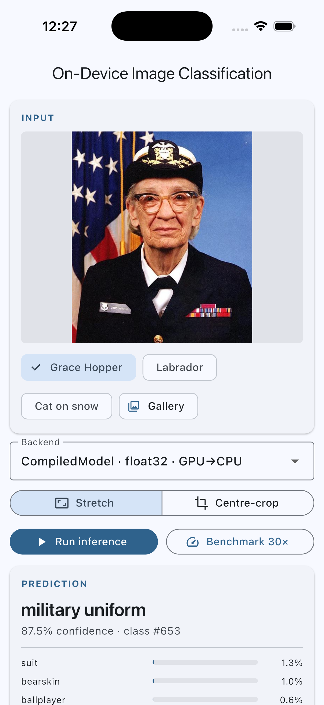
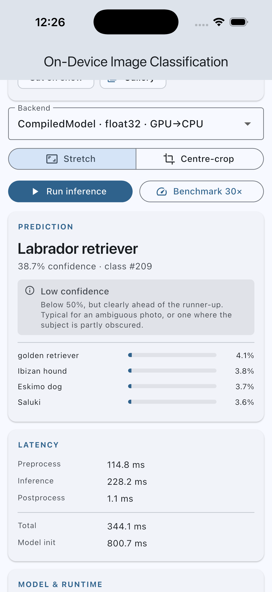
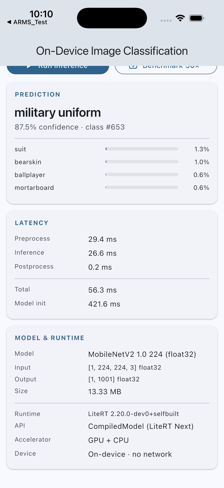

# On-device image classification in Flutter with LiteRT

A Flutter app that looks at a photo and says what's in it — **entirely on the phone**. No server, no API key,
no internet connection. It exists to be inspected, run, measured and defended in a technical review, not to
look impressive.

<p>



</p>

> Middle image: the app does not let a weak result pass as a confident one. Below 50% it says so, and when the
> runner-up is close too it says *"Inconclusive"* — because these models cannot abstain, so a low score usually
> means the subject isn't among the 1,001 classes at all.
>
> Captured from the current build on an iPhone 17 simulator. **The latency figures shown are from a debug
> simulator run** — they are *not* the numbers quoted elsewhere in this README, which come from release runs on a
> physical iPhone 13 Pro (20.3 ms total). Debug builds and simulators are both slower; see
> [`docs/BENCHMARKS.md`](docs/BENCHMARKS.md) for the measured device figures.

## New to on-device AI? Start here

**[`docs/GLOSSARY.md`](docs/GLOSSARY.md) explains every term in this repo in plain language** — no maths, no
prior ML experience assumed. If a word below is unfamiliar, it's defined there.

The short version of what's happening:

1. **A model is just a file.** Ours is 13 MB of numbers that Google trained on a million photos, then froze.
   You can copy it, email it, delete it. It never changes while the app runs.
2. **We turn the photo into numbers the file expects.** Decode the JPEG, squash it to 224×224 pixels, and
   arrange those pixels into exactly 602,112 bytes in exactly the right order. This step is where most bugs
   live, and it takes longer than the AI does.
3. **A native runtime (LiteRT) multiplies those numbers through the model.** This is the part everyone calls
   AI. On a real iPhone it takes about 4.5 milliseconds.
4. **We read the answer.** The model returns 1,001 scores, one per category it knows. We sort them and look up
   the winning name: "military uniform, 87.5%".

That's the whole idea. Everything else in this repo is about *how fast*, *on which chip*, and *how do we know
it's actually correct*.

The word for step 3 is **inference** — running an already-trained model. Nothing here trains anything; training
happens in a data centre, and it's a completely different job.

## The most interesting thing we found

We asked the iPhone's dedicated AI chip (the **Neural Engine**) to run the model. It accepted the job,
completed it — and returned answers that were **4.946% wrong**, the same wrong amount every single run.

The app refused to use it, because it checks every accelerator against the plain CPU at startup before trusting
it. Without that check we would have shipped an app that was quietly, consistently a bit wrong. It wouldn't
have crashed. Nobody would have filed a bug.

Worse: that same configuration reported **perfectly healthy on the iPhone simulator**, because the simulator
has no Neural Engine at all and quietly runs on the Mac's own processors instead.

If you take one thing from this project, take that: **"accelerated" and "correct" are separate properties, and
a simulator cannot tell you about either.** The full story is in [`docs/BENCHMARKS.md`](docs/BENCHMARKS.md).

## What it demonstrates

| Topic | How it is demonstrated here |
|---|---|
| **On-device ML** | Weights ship as a Flutter asset, load via `rootBundle`, and execute in a native runtime linked into the app. No server exists in this codebase |
| **LiteRT** | Both current APIs: LiteRT Next `CompiledModel` (accelerator-first, float32-only) and the classic `Interpreter` (explicit delegates, quantized input/output) |
| **Flutter integration** | Dart talks to native code over `dart:ffi` via `flutter_litert`; the UI never touches a runtime object |
| **Inference** | The full pipeline is explicit and measured stage by stage: decode → resize → normalise → tensor → invoke → dequantise → sort → label |
| **Offline execution** | Proven, not asserted — the release APK declares no `INTERNET` permission, so the OS kernel won't let it open a connection, and the whole suite passes with the network unreachable. See [`docs/OFFLINE_VERIFICATION.md`](docs/OFFLINE_VERIFICATION.md) |
| **Honest hardware reporting** | The UI shows which chips were *requested* vs *actually used*. Behind it, every model is checked against a plain-CPU reference at startup — which on a real iPhone **caught the Neural Engine returning wrong output** and refused it |
| **Honest *result* reporting** | A prediction below 50% is labelled *"Low confidence"*, and one where the runner-up is also close is labelled *"Inconclusive"* — because these models cannot abstain, and a low score usually means the subject isn't among the 1,001 classes at all |
| **Preprocessing as a variable** | A toggle switches between stretching the photo to a square and the standard ImageNet centre-crop, so you can watch framing change the confidence on your own images |

## Status

```text
Build (physical iPhone)   PASS   iPhone 13 Pro (A15), iOS 26.6 - signed, installed, run
Build (iOS simulator)     PASS
Build (Android release)   PASS
Inference                 PASS   matched against a Python reference on all three targets
Offline test              PASS   no INTERNET permission in release; suite passes with network unreachable
iOS (device + simulator)  PASS
Android                   PASS   Pixel 8 emulator, arm64-v8a
Tests                     PASS   86 unit + 15 integration (13 pass / 2 skipped on device)

GPU acceleration (iOS)    VERIFIED       Metal on A15: ~4.5-4.9 ms vs 9.54 ms CPU-only = ~2x speed-up
                                         (1.95-2.11x across three runs)
NPU / Neural Engine       ENGAGED, REJECTED   Core ML on A15 deviates 4.946% from the CPU reference
                                         (reproducible bit-for-bit) - the app refuses the backend
GPU / NPU (Android)       NOT VERIFIED   emulator has no OpenCL, no vendor NPU runtime;
                                         no physical Android device available
Battery / thermal         NOT MEASURED
```

## Architecture

Read this top to bottom — it's the actual path a photo takes through the app.

```text
Flutter UI          lib/ui/                 no LiteRT import, no tensor code
   ↓
Controller          lib/application/        state machine, lifecycle, benchmarking
   ↓
OnDeviceModel       lib/domain/             the seam: pure-Dart interface
   ↓
ML Service          lib/data/               preprocess · runtime call · postprocess
   ↓
flutter_litert                              dart:ffi binding (community-maintained)
   ↓
LiteRT runtime                              CompiledModel  |  Interpreter
   ↓
CPU / GPU / Accelerator                     XNNPACK · OpenCL/Metal · Core ML / vendor NPU
   ↓
Prediction
```

**Why the layers matter, in one sentence:** only **two files** out of 24 in `lib/` mention LiteRT at all, so
everything above them can be tested with a fake model and no native code — which is exactly what
`test/classification_controller_test.dart` does.

That boundary is this interface, and it's the whole design in 8 lines:

```dart
abstract interface class OnDeviceModel {
  ModelSpec get spec;
  RuntimeReport get runtimeReport;
  Future<void> initialize();
  Future<PredictionResult> predict(InputImage image, {int topK = 5});
  Future<void> dispose();
}
```

Swapping LiteRT for ONNX Runtime, or for a cloud endpoint, means writing a third class behind this interface.
The UI and controller wouldn't change. Full detail, including the threading model, is in
[`docs/ARCHITECTURE.md`](docs/ARCHITECTURE.md).

## Models

Two pretrained models, both published by Google under Apache-2.0, downloaded by `tool/fetch_models.sh`.
Nothing was trained or converted locally. Every value below was read out of the actual files by
`tool/inspect_model.py` — see [`docs/MODEL_INSPECTION.md`](docs/MODEL_INSPECTION.md).

We ship two on purpose: one **float32** model (bigger, more precise) and one **quantized uint8** model
(smaller, coarser). That's the central trade-off in on-device ML, and having both makes it a measured fact
instead of a claim.

| | MobileNetV2 1.0 224 | MobileNetV1 1.0 224 quant |
|---|---|---|
| File | `mobilenet_v2_1.0_224.tflite` | `mobilenet_v1_1.0_224_quant.tflite` |
| Size | 13,978,596 B (13.33 MiB) | 4,276,352 B (4.08 MiB) |
| SHA-256 | `9f3bc29e…8d3303` | `ecc3a67c…7d20dd` |
| Input | `[1,224,224,3]` float32, 602,112 B | `[1,224,224,3]` uint8, 150,528 B |
| Input quantization | none | scale 1/128, zero-point 128 |
| Preprocessing | `byte / 127.5 − 1` → [−1, 1] | **raw bytes** — the model does the scaling itself |
| Output | `[1,1001]` float32 | `[1,1001]` uint8, scale 1/256, zero-point 0 |
| Output meaning | probabilities (SOFTMAX inside the model) | probabilities after dequantisation |
| Labels | 1001 lines, index 0 = `background` | same file |
| LiteRT API | `CompiledModel` **or** `Interpreter` | `Interpreter` only |

**One detail worth understanding, because it's a classic beginner trap.** A model expects its input numbers in
a specific range, and a float32 `.tflite` file **doesn't record which one**. Guess wrong and nothing crashes —
you just get worse answers. So we measured it: on `grace_hopper.jpg`, scaling to [−1,1] gives "military
uniform" at 0.8035; [0,1] gives the same label at only 0.2754; and leaving the raw [0,255] bytes gives
"pillow" at 0.4009 — confidently wrong.

The quantized model is the mirror image: the scaling is *baked into the file* as quantization parameters, so
feeding it raw bytes is correct and normalising in Dart too would apply the scaling twice.

## Why LiteRT for this PoC

Because the premise is **a custom model running locally**, and that is exactly LiteRT's job. ML Kit would be
the better choice if the task were OCR or barcode scanning; ONNX Runtime would be better if we already had an
ONNX pipeline; cloud would be better for a model too large to ship. None of those is the case here.

`CompiledModel` (LiteRT Next) is the primary path because it is the current recommended API, it picks
NPU→GPU→CPU itself, and — critically for a PoC that must not overclaim — it reports which chips it actually
used. The classic `Interpreter` is also implemented because `CompiledModel` is **float32-only**, so the
quantized model cannot use it at all. Having both behind one interface turns that constraint into a measured
fact, and gives a fair comparison on identical weights. Full discussion, with caveats for each alternative, is
in [`docs/COMPARISON.md`](docs/COMPARISON.md).

## Performance

**iPhone 13 Pro (A15 Bionic), iOS 26.6** — warm medians over 30 runs. Full tables, including the emulated
targets and an explanation of how to read them, in [`docs/BENCHMARKS.md`](docs/BENCHMARKS.md).

For scale as you read these: a 60 fps screen draws a frame every 16.7 ms.

| Backend | Inference | Total |
|---|---:|---:|
| Interpreter · uint8 · no delegate | **3.51 ms** | 18.8 ms |
| CompiledModel · float32 · GPU→CPU | 4.53 ms | 20.3 ms |
| Interpreter · float32 · XNNPACK | 4.79 ms | 20.1 ms |
| Interpreter · uint8 · XNNPACK | 6.17 ms | 21.2 ms |
| CompiledModel · float32 · CPU only | 9.54 ms | 24.9 ms |
| CompiledModel · float32 · NPU→CPU | **refused — wrong output** | — |

Four findings worth stating plainly:

1. **The Neural Engine returned numerically wrong output, and the app refused it.** Core ML compiled fine, then
   deviated **4.946% of output range** from a plain-CPU reference — reproducible bit-for-bit across runs,
   against 0.0005% for healthy configurations. Consistent with fp16 (reduced-precision) computation on the
   Neural Engine. Without the startup verification this would have shipped silently wrong predictions.
2. **GPU (Metal) is verified and real:** 4.53–4.90 ms vs 9.54 ms CPU-only on the same API and weights — a
   **≈2× speed-up** (1.95–2.11× across three runs; the GPU is the variable side, the CPU is repeatable).
3. **Simulator benchmarks led us to a wrong conclusion.** On the simulator `Interpreter`+XNNPACK appeared
   ~2.9× faster than `CompiledModel`; on real hardware the ordering reverses, because the simulator has no
   mobile GPU. Do not draw architectural conclusions from emulated measurement.
4. **Preprocessing dominates:** ~15 ms of Dart decode+resize against 3.5–9.5 ms of inference — 75–81% of total
   latency. Inference sped up ~4× moving to real hardware; preprocessing barely moved, because it is
   single-threaded Dart. Also note XNNPACK — a library whose entire purpose is speed — made the *quantized*
   model 76% slower on this device (6.17 vs 3.51 ms). Delegates are not automatically a win.

## Limitations

Stated plainly, because a PoC that hides its costs isn't useful to anyone.

* **Binary size.** arm64 release APK is **51.5 MB** vs **15.5 MB** for an empty Flutter app: +36 MB, of which
  17.4 MB is models and 14.6 MB is LiteRT native libraries per ABI. Always split per ABI or ship an App
  Bundle — the universal APK is 112.5 MB.
* **Platform support.** Android and iOS are built and tested here. `flutter_litert` also claims macOS, Windows,
  Linux and web; **not verified** in this project.
* **Hardware variance is the headline risk.** The same code, three targets: verified Metal acceleration on an
  A15; a hard GPU compilation failure on the Android emulator
  (`LiteRtCreateManagedTensorBufferFromRequirements … kLiteRtStatusErrorRuntimeFailure`) falling back to CPU;
  and a Core ML/Neural Engine path that is *numerically wrong on the real device but reported healthy on the
  simulator*. Every performance and correctness claim must be validated per device tier, on physical hardware.
* **`isFullyAccelerated` is not a fallback detector.** The binding documents `false` as ambiguous. This app
  displays it but never uses it to assert acceleration; it compares output against a plain-CPU reference
  instead — and even that proves only that *a different compute path* ran, not which chip.
* **Quantized confidences are coarse.** The output step is 1/256, so probabilities below 1/512 round to zero
  and the distribution sums to 0.95–0.99 rather than 1.0. Do not read quantized confidences as calibrated
  probabilities.
* **Delegate + background thread is mutually exclusive** in this binding on the `Interpreter` path, so the
  XNNPACK configurations block the calling isolate for 4.8–6.2 ms — roughly one dropped frame at 60 Hz.
  Production code would own a worker isolate and construct the interpreter inside it.
* **The NPU is unusable for this model as-is.** Not a runtime bug we can work around from Dart: the model would
  need validating (or retraining) for reduced precision. Untested whether an fp16-tolerant model passes.
* **Model updates.** Both models are bundled, so updating one means shipping an app release. A production
  system would fetch models at runtime into app storage, verify a signature and digest before use, keep the
  bundled model as a fallback, and pin `ModelSpec` per model version — the tensor contract is part of the API
  between app and model. `initialize()` already validates size and tensor contract, which is the same check an
  over-the-air path needs.
* **Aspect ratio is a choice, not a fix.** The app ships both fittings and a toggle: **stretch** (default,
  keeps the whole frame, distorts non-square photos) and **centre-crop** (the standard ImageNet recipe,
  preserves shape, discards the edges). Neither wins everywhere — cropping took the Labrador photo from 0.2751
  to **0.5101**, and took Grace Hopper from 0.8035 down to 0.5195 by cropping the uniform out of frame. Stretch
  stays the default because it matches `tool/reference_predict.py` and the committed fixture, so the bit-level
  parity tests describe that path. See [`docs/QA.md`](docs/QA.md) question 19b.
* **The model cannot say "I don't know."** It always returns one of 1,001 ImageNet classes — a set with 120 dog
  breeds and **no** person, building, road or food class. Photograph anything outside that list and you get a
  confident-looking label at a low score. The UI now flags this (*"Low confidence"* under 50%, *"Inconclusive"*
  when the runner-up is also close), but the underlying limit is the model's vocabulary, not the app.
* **Not a camera app.** Single-image classification only. A live pipeline needs frame throttling, YUV→RGB
  conversion and back-pressure, none of which is here.

## Running it

The `.tflite` weights are **not committed** — they are 17 MB of binaries that `tool/fetch_models.sh` reproduces
byte-for-byte from Google's public storage, with SHA-256 digests asserted at app startup and in the test suite.
So step 1 is not optional on a fresh clone.

```bash
# 1. Fetch the models (~85 MB download, only the .tflite files are kept)
./tool/fetch_models.sh

# 2. Regenerate the reference fixture (optional — it is committed)
python3 tool/inspect_model.py
python3 tool/reference_predict.py

# 3. Dependencies
flutter pub get

# 4. Static analysis and unit tests (no device needed)
flutter analyze
flutter test

# 5. Run the app
flutter run -d <device-id>          # `flutter devices` to list

# 6. Real inference on a device, validated against the Python reference,
#    plus the 30-run benchmark. This is what produces docs/BENCHMARKS.md.
flutter test integration_test/on_device_inference_test.dart -d <device-id>

# 7. Release build + the offline audit
flutter build apk --release --split-per-abi
aapt2 dump permissions build/app/outputs/flutter-apk/app-arm64-v8a-release.apk
```

Requires Python 3 with `tensorflow`, `numpy` and `Pillow` for the reference tooling only — the app itself needs
none of it.

**If you're new here and want to actually learn something:** run step 5, then point the app at a photo of
something *not* in its 1,001 categories — a laptop charger, a houseplant, your desk. Watch it confidently pick
the closest thing it knows. That single experiment teaches more about how these models behave than any
tutorial: the model always answers, even when the right answer isn't available to it.
[`docs/GLOSSARY.md`](docs/GLOSSARY.md) has more experiments like that.

## Testing strategy

**86 unit tests** run on the host machine with no native runtime, covering the layers where classification bugs
actually live:

* `image_preprocessor_test.dart` — normalisation compared **element-by-element against the Python reference
  tensor** on a deterministic 224×224 PNG, so no resizing is involved and any difference is a real bug. Plus
  decode failures: empty, truncated, non-image.
* `image_resize_test.dart` — measures Dart's resizing against the reference and asserts the chosen filter beats
  every alternative. This test caught a real defect: `Interpolation.linear` does not antialias when shrinking
  an image, and switching to area-average on ≥1.5× shrink cut the mean error from 7.7 to 4.0 levels and fixed a
  wrong top answer on `labrador.jpg`.
* `classification_postprocessor_test.dart` — dequantisation, softmax-only-when-needed, top-K ordering, tie
  determinism, the 1001-vs-1000 label trap.
* `label_repository_test.dart`, `model_catalog_test.dart` — asset integrity by SHA-256, spec-vs-fixture
  agreement, registry invariants.
* `benchmark_test.dart`, `classification_controller_test.dart` — statistics, cold/warm split, and the full
  controller state machine including every error path, driven by `FakeOnDeviceModel`.

**15 integration tests** run on a real device or emulator, because they need what a host machine cannot
provide: FFI, the native runtime, chip selection and real arithmetic. They check every backend against the
reference fixture, verify `dispose()` is idempotent, confirm the app recovers from a rejected input, and emit
the benchmark lines.

What is **not** covered by tests: Android GPU/NPU execution on real silicon, thermal and battery behaviour, and
UI-driven inference in an Android release build.

## Honesty notes

* `flutter_litert` is **community-maintained** (publisher `hugo.ml`), not a Google package. Google ships no
  first-party Flutter binding — `litert_flutter` from publisher `tensorflow.org` is an abandoned `0.0.1` stub.
  This is a shared risk across the ecosystem: ML Kit's Flutter plugins also state they are not maintained by
  Google, and the main ONNX Runtime plugin is unmaintained with competing forks.
* Primary numbers come from a **physical iPhone 13 Pro**; emulator/simulator tables are retained only to show
  how misleading emulated measurement was. No physical **Android** device was available, so Android GPU and
  vendor-NPU acceleration remain unverified.
* iOS **GPU (Metal) acceleration is verified** by a like-for-like ≈2× measurement, repeated three times. The **Neural Engine was
  engaged but rejected** for numerically wrong output; we therefore have **no Neural Engine latency figure**,
  and quoting one would mean quoting a wrong-output configuration.
* An earlier revision of these docs concluded from simulator data that the classic `Interpreter` API was ~2.9×
  faster than `CompiledModel`. Real hardware reversed that. The claim was corrected, not quietly dropped.
* One check was attempted and abandoned rather than fudged: UI-driven inference in an Android **release** build,
  because the emulator's System UI kept freezing and swallowing taps. An earlier socket audit that compared
  against an empty uid string produced four convenient zeros; it was discarded and redone with a positive
  control.
* The on-screen UI deliberately shows values only — model, tensor shapes, chips used, latency. The reasoning,
  caveats and verification prose live in `docs/` and the slides, not on the device.

## Where to read next

| If you want to… | Read |
|---|---|
| Understand the vocabulary | [`docs/GLOSSARY.md`](docs/GLOSSARY.md) — start here if you're new |
| See the numbers and what they mean | [`docs/BENCHMARKS.md`](docs/BENCHMARKS.md) |
| Understand the code structure | [`docs/ARCHITECTURE.md`](docs/ARCHITECTURE.md) |
| Choose between LiteRT / ML Kit / ONNX / cloud | [`docs/COMPARISON.md`](docs/COMPARISON.md) |
| Check the offline claim yourself | [`docs/OFFLINE_VERIFICATION.md`](docs/OFFLINE_VERIFICATION.md) |
| See what's actually inside the model files | [`docs/MODEL_INSPECTION.md`](docs/MODEL_INSPECTION.md) |
| Present this to a team | [`docs/SLIDES.md`](docs/SLIDES.md) + [`docs/SPEAKER_NOTES.md`](docs/SPEAKER_NOTES.md) |
| Prepare for hard questions | [`docs/QA.md`](docs/QA.md) |

## Repository layout

```text
lib/domain/        pure-Dart contracts: OnDeviceModel, ModelSpec, exceptions, PredictionResult
lib/data/          LiteRT implementations, preprocessing, postprocessing, catalogue, registry
lib/application/   controller, benchmark statistics
lib/ui/            page + diagnostic cards
assets/models/     two .tflite files + 1001-line label file
assets/images/     three sample photos + generated calibration pattern
tool/              fetch_models.sh, inspect_model.py, reference_predict.py
test/              86 host-side unit tests + generated reference fixture
integration_test/  on-device inference validation and benchmark harness
docs/              glossary, architecture, model inspection, benchmarks, offline verification,
                   comparison, slides, speaker notes, Q&A
```
