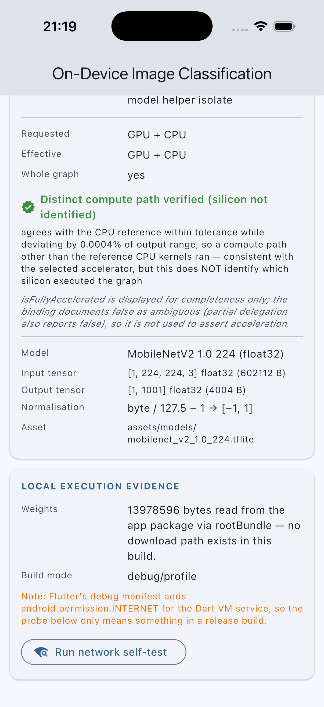

# On-device image classification in Flutter with LiteRT

A proof of concept that runs **real image classification locally on the device** through LiteRT, with no
cloud inference anywhere in the pipeline. It exists to be inspected, run, measured and defended in a
technical review — not to look impressive.

<p>


</p>

## What it demonstrates

| Topic | How it is demonstrated here |
|---|---|
| **On-device ML** | Weights ship as a Flutter asset, load via `rootBundle`, and execute in a native runtime linked into the app. No server exists in this codebase |
| **LiteRT** | Both current APIs: LiteRT Next `CompiledModel` (accelerator-first, float32-only) and the classic `Interpreter` (explicit delegates, quantized I/O) |
| **Flutter integration** | Dart ↔ native over `dart:ffi` via `flutter_litert`; the UI never touches a runtime object |
| **Inference** | The full pipeline is explicit and measured stage by stage: decode → resize → normalise → tensor → invoke → dequantise → sort → label |
| **Offline execution** | Proven, not asserted — the release APK declares no `INTERNET` permission, and the whole suite passes with the network unreachable. See [`docs/OFFLINE_VERIFICATION.md`](docs/OFFLINE_VERIFICATION.md) |
| **Honest hardware reporting** | The UI shows accelerators *requested* vs *actually kept*, and whether that was verified against a CPU reference. NPU/GPU use is reported as **Not verified** on emulated targets, because it cannot be verified there |

## Status

```text
Build (iOS simulator)     PASS
Build (Android release)   PASS
Inference                 PASS   6 backend configs x 3 images, matched against a Python reference
Offline test              PASS   no INTERNET permission in release; suite passes with network unreachable
Android                   PASS   Pixel 8 emulator, arm64-v8a
iOS                       PASS   iPhone 17 simulator, iOS 26.2
Tests                     PASS   69 unit tests + 15 on-device integration tests
GPU acceleration          NOT VERIFIED   emulator has no OpenCL; simulator GPU is the host Mac's
NPU / Neural Engine       NOT VERIFIED   no physical device in scope
```

## Architecture

```text
Flutter UI          lib/ui/                 no LiteRT import, no tensor code
   ↓
Controller          lib/application/        state machine, lifecycle, benchmarking
   ↓
OnDeviceModel       lib/domain/             the seam: pure-Dart interface
   ↓
ML Service          lib/data/               preprocess · runtime call · postprocess
   ↓
flutter_litert                              dart:ffi binding (community-maintained)
   ↓
LiteRT runtime                              CompiledModel  |  Interpreter
   ↓
CPU / GPU / Accelerator                     XNNPACK · OpenCL/Metal · Core ML / vendor NPU
   ↓
Prediction
```

Only **two files** out of 25 in `lib/` import `flutter_litert`. That is what lets
`test/classification_controller_test.dart` drive the entire application layer with a fake model and no
native code. Full detail, including the end-to-end inference path and the threading model, is in
[`docs/ARCHITECTURE.md`](docs/ARCHITECTURE.md).

The seam:

```dart
abstract interface class OnDeviceModel {
  ModelSpec get spec;
  RuntimeReport get runtimeReport;
  Future<void> initialize();
  Future<PredictionResult> predict(InputImage image, {int topK = 5});
  Future<void> dispose();
}
```

## Models

Two pretrained models, both published by Google under Apache-2.0, fetched by `tool/fetch_models.sh`.
Nothing was trained or converted locally. Every value below was read out of the actual files by
`tool/inspect_model.py` — see [`docs/MODEL_INSPECTION.md`](docs/MODEL_INSPECTION.md).

| | MobileNetV2 1.0 224 | MobileNetV1 1.0 224 quant |
|---|---|---|
| File | `mobilenet_v2_1.0_224.tflite` | `mobilenet_v1_1.0_224_quant.tflite` |
| Size | 13,978,596 B (13.33 MiB) | 4,276,352 B (4.08 MiB) |
| SHA-256 | `9f3bc29e…8d3303` | `ecc3a67c…7d20dd` |
| Input | `[1,224,224,3]` float32, 602,112 B | `[1,224,224,3]` uint8, 150,528 B |
| Input quantization | none | scale 1/128, zero-point 128 |
| Preprocessing | `byte / 127.5 − 1` → [−1, 1] | **raw bytes** — the graph does the scaling |
| Output | `[1,1001]` float32 | `[1,1001]` uint8, scale 1/256, zero-point 0 |
| Output semantics | probabilities (SOFTMAX in graph) | probabilities after dequantisation |
| Labels | 1001 lines, index 0 = `background` | same file |
| LiteRT API | `CompiledModel` **or** `Interpreter` | `Interpreter` only |

The float model's normalisation is not documented in the file — a float32 `.tflite` carries no
preprocessing metadata. It was determined **experimentally**: on `grace_hopper.jpg`, [−1,1] gives
"military uniform" at 0.8035, [0,1] at 0.2754, and [0,255] gives "pillow" at 0.4009. The quantized model
is the opposite case: its input quantization parameters *are* the normalisation, which is why feeding raw
bytes is correct and normalising in Dart as well would scale twice.

## Why LiteRT for this PoC

Because the premise is **a custom model running locally**, and that is exactly LiteRT's job. ML Kit would
be the better choice if the task were OCR or barcode scanning; ONNX Runtime would be better if we already
had an ONNX pipeline; cloud would be better for a model too large to ship. None of those is the case here.

`CompiledModel` (LiteRT Next) is the primary path because it is the current recommended API, it performs
NPU→GPU→CPU selection itself, and — critically for a PoC that must not overclaim — it reports which
accelerators it actually kept. The classic `Interpreter` is also implemented because `CompiledModel` is
**float32-only**, so the quantized model cannot use it at all. Having both behind one interface turns that
constraint into a measured fact rather than a claim, and gives an apples-to-apples comparison on identical
weights. Full discussion, with the caveats for each alternative, is in
[`docs/COMPARISON.md`](docs/COMPARISON.md).

## Performance

Measured on emulated targets only; see [`docs/BENCHMARKS.md`](docs/BENCHMARKS.md) for the full tables and
for why these are *relative* comparisons, not latency budgets. 30 runs per backend, cold reported
separately from warm.

iOS Simulator (iPhone 17, iOS 26.2), warm medians:

| Backend | Inference | Total |
|---|---:|---:|
| Interpreter · float32 · XNNPACK | **3.93 ms** | 23.9 ms |
| Interpreter · uint8 · XNNPACK | 4.67 ms | 24.4 ms |
| Interpreter · uint8 · no delegate | 4.95 ms | 24.9 ms |
| CompiledModel · float32 · CPU | 11.41 ms | 30.9 ms |
| CompiledModel · float32 · GPU→CPU | 11.47 ms | 31.3 ms |
| CompiledModel · float32 · NPU→CPU | 16.80 ms | 36.6 ms |

Three findings worth stating plainly:

1. **Preprocessing dominates.** ~19.5 ms of Dart-side decode+resize against 3.9 ms of inference. If this
   needed 30 fps, the model is not the bottleneck — the JPEG is.
2. **The newer API was not the faster one here.** `Interpreter`+XNNPACK beat `CompiledModel` by ~2.9× on the
   same weights. Part of that is the helper-isolate hop `runAsync` pays; the rest is real. Choosing
   `CompiledModel` buys future NPU access and automatic selection, not present-day speed on this hardware.
3. **The first model of the process is expensive.** First `CompiledModel` creation took 1782 ms; the second
   took 125 ms, because the LiteRT environment (GPU stack, kernel cache) is created once per isolate. Warm
   up off the critical path.

## Limitations

* **Binary size.** arm64 release APK is **51.5 MB** vs **15.5 MB** for an empty Flutter app: +36 MB, of
  which 17.4 MB is models and 14.6 MB is LiteRT native libraries per ABI. Always split per ABI or ship an
  App Bundle — the universal APK is 112.5 MB.
* **Platform support.** Android and iOS are built and tested here. `flutter_litert` also claims macOS,
  Windows, Linux and web; **not verified** in this project.
* **Hardware variance.** Accelerator availability is per-device, not per-platform. The same code got
  GPU+CPU on the iOS simulator and a hard GPU compilation failure on the Android emulator
  (`LiteRtCreateManagedTensorBufferFromRequirements … kLiteRtStatusErrorRuntimeFailure`), correctly falling
  back to CPU. Any performance promise must be validated per target device tier.
* **`isFullyAccelerated` is not a fallback detector.** The binding documents `false` as ambiguous. This app
  displays it but never uses it to assert acceleration; it uses an output-deviation comparison against a
  plain-CPU reference instead — and even that proves only that *a different compute path* ran, not which
  silicon.
* **Quantized confidences are coarse.** The output step is 1/256, so probabilities below 1/512 round to
  zero and the distribution sums to 0.95–0.99 rather than 1.0. Do not read quantized confidences as
  calibrated probabilities.
* **Delegate + background isolate is mutually exclusive** in this binding on the `Interpreter` path, so the
  XNNPACK configurations block the calling isolate for 4–9 ms. Production code would own a worker isolate
  and construct the interpreter inside it.
* **Model updates.** Both models are bundled, so updating one means shipping an app release. A production
  system would fetch models at runtime into app storage, verify a signature and digest before use, keep the
  bundled model as a fallback, and pin `ModelSpec` per model version — the tensor contract is part of the
  API between app and model. `initialize()` already validates size and tensor contract, which is the same
  check an OTA path needs.
* **Aspect ratio.** Preprocessing stretches to 224×224 rather than centre-cropping, so non-square inputs are
  distorted. Deliberate and flagged via `PreprocessedImage.distortedAspectRatio`; the standard ImageNet
  recipe centre-crops to 87.5% first.
* **Not a camera app.** Single-image classification only. A live pipeline needs frame throttling, YUV→RGB
  conversion and back-pressure, none of which is here.

## Running it

The `.tflite` weights are **not committed** — they are 17 MB of binaries that `tool/fetch_models.sh`
reproduces byte-for-byte from Google's public storage, with SHA-256 digests asserted at app startup and in
the test suite. So step 1 is not optional on a fresh clone.

```bash
# 1. Fetch the models (~85 MB download, only the .tflite files are kept)
./tool/fetch_models.sh

# 2. Regenerate the reference fixture (optional — it is committed)
python3 tool/inspect_model.py
python3 tool/reference_predict.py

# 3. Dependencies
flutter pub get

# 4. Static analysis and unit tests (no device needed)
flutter analyze
flutter test

# 5. Run the app
flutter run -d <device-id>          # `flutter devices` to list

# 6. Real inference on a device, validated against the Python reference,
#    plus the 30-run benchmark. This is what produces docs/BENCHMARKS.md.
flutter test integration_test/on_device_inference_test.dart -d <device-id>

# 7. Release build + the offline audit
flutter build apk --release --split-per-abi
aapt2 dump permissions build/app/outputs/flutter-apk/app-arm64-v8a-release.apk
```

Requires Python 3 with `tensorflow`, `numpy` and `Pillow` for the reference tooling only — the app itself
needs none of it.

## Testing strategy

**69 unit tests** run on the host VM with no native runtime, covering the layers where classification bugs
actually live:

* `image_preprocessor_test.dart` — normalisation compared **element-by-element against the Python
  reference tensor** on a deterministic 224×224 PNG, so no resampling is involved and any difference is a
  real bug. Plus decode failures: empty, truncated, non-image.
* `image_resize_test.dart` — measures Dart's resampling against the reference and asserts the chosen filter
  beats every alternative. This test caught a real defect: `Interpolation.linear` does not antialias on
  downscale, and switching to area-average on ≥1.5× shrink cut the mean error from 7.7 to 4.0 levels and
  fixed a top-1 disagreement on `labrador.jpg`.
* `classification_postprocessor_test.dart` — dequantisation, softmax-only-when-needed, top-K ordering, tie
  determinism, the 1001-vs-1000 label trap.
* `label_repository_test.dart`, `model_catalog_test.dart` — asset integrity by SHA-256, spec-vs-fixture
  agreement, registry invariants.
* `benchmark_test.dart`, `classification_controller_test.dart` — statistics, cold/warm split, and the full
  controller state machine including every error path, driven by `FakeOnDeviceModel`.

**15 integration tests** run on a device because they need what the host cannot provide: FFI, the native
runtime, delegate selection and real arithmetic. They check every backend against the reference fixture,
verify `dispose()` is idempotent, confirm the app recovers from a rejected input, and emit the benchmark
lines.

What is **not** covered by tests: GPU/NPU execution on real silicon, thermal and battery behaviour, and the
iOS release/physical-device path.

## Honesty notes

* `flutter_litert` is **community-maintained** (publisher `hugo.ml`), not a Google package. Google ships no
  first-party Flutter binding — `litert_flutter` from publisher `tensorflow.org` is an abandoned `0.0.1`
  stub. This is a shared risk across the ecosystem: ML Kit's Flutter plugins also state they are not
  maintained by Google, and the main ONNX Runtime plugin is unmaintained with competing forks.
* All performance numbers come from an **emulator and a simulator**. No physical device was used.
* No NPU or GPU acceleration claim is made. Where the runtime reported `effective = NPU + CPU` on the iOS
  simulator, that means Core ML accepted the graph — on a simulator Core ML runs on the host Mac, and there
  is no Neural Engine, so **ANE usage is not verified**.
* One check was attempted and abandoned rather than fudged: UI-driven inference in an Android **release**
  build, because the emulator's System UI kept ANR-ing and swallowing taps. An earlier socket audit that
  compared against an empty uid string produced four convenient zeros; it was discarded and redone with a
  positive control.

## Repository layout

```text
lib/domain/        pure-Dart contracts: OnDeviceModel, ModelSpec, exceptions, PredictionResult
lib/data/          LiteRT implementations, preprocessing, postprocessing, catalogue, registry
lib/application/   controller, benchmark statistics, network self-test
lib/ui/            page + diagnostic cards
assets/models/     two .tflite files + 1001-line label file
assets/images/     three sample photos + generated calibration pattern
tool/              fetch_models.sh, inspect_model.py, reference_predict.py
test/              69 host-side unit tests + generated reference fixture
integration_test/  on-device inference validation and benchmark harness
docs/              architecture, model inspection, benchmarks, offline verification,
                   comparison, slides, speaker notes, Q&A
```
